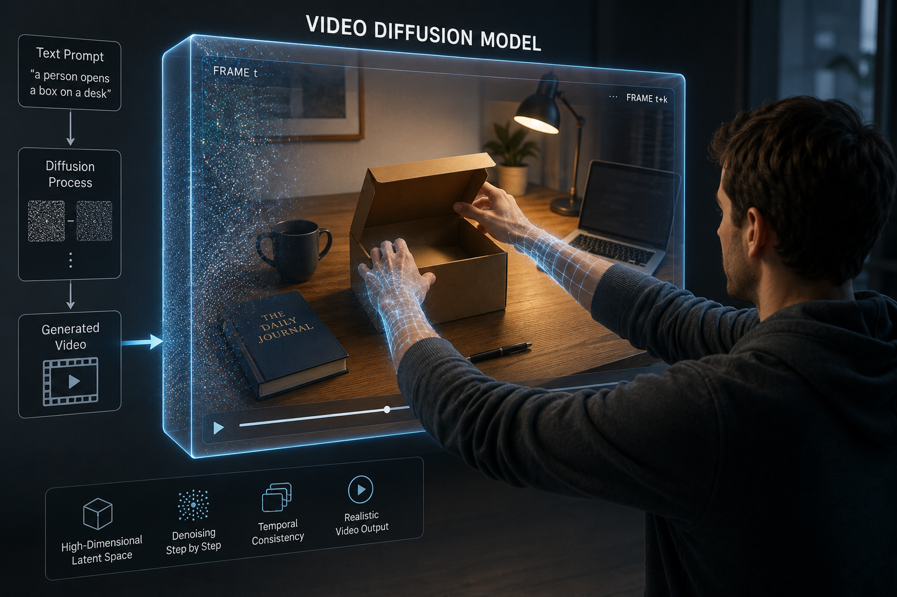

<div align="center">

# Hand2World: Autoregressive Egocentric Interaction Generation via Free-Space Hand Gestures

<a href="https://arxiv.org/abs/2602.09600"></a>
<a href="https://hand2world.github.io"></a>

[Yuxi Wang](https://github.com/NTUYWANG103)<sup>1</sup>,
[Wenqi Ouyang](https://vicky0522.github.io/Wenqi-Ouyang/)<sup>1</sup>,
[Tianyi Wei](https://wtybest.github.io/)<sup>1</sup>,
[Yi Dong](https://www.researchgate.net/scientific-contributions/Yi-Dong-2045801273)<sup>1</sup>,
[Zhiqi Shen](https://personal.ntu.edu.sg/zqshen/)<sup>1</sup>,
[Xingang Pan](https://xingangpan.github.io/)<sup>1</sup>

<sup>1</sup>College of Computing and Data Science, Nanyang Technological University



</div>

## TODO

- [x] Release inference code
  - [x] Wan 2.2-5B bidirectional + AR model + checkpoints
  - [x] Closed-loop demo (server + client + iPhone SDK + iOS app)
- [ ] Release training code
- [ ] Release our [ViDiHand](https://github.com/NTUYWANG103/ViDiHand) data annotation pipeline

Note: We retrain the model on a Wan 2.2 backbone using the ARCTIC dataset only. The AR variant is distilled into a blockwise autoregressive model via Causal Forcing++, and hand-pose annotations are obtained using our [ViDiHand](https://github.com/NTUYWANG103/ViDiHand) pipeline. We may release a larger pretrained checkpoint in the future.

## Setup

```bash
conda create -n hand2world python=3.10 -y
conda activate hand2world
pip install -r requirements.txt
```

[nvdiffrast](https://github.com/NVlabs/nvdiffrast) is required for the closed-loop demo's hand render — install per its repo instructions.

Output mp4 encoding uses **libx264** via `imageio-ffmpeg`; on minimal systems install a system ffmpeg (`apt install ffmpeg` / `brew install ffmpeg`) if you hit `Unknown encoder libx264`.

## Offline inference (`predict.py`)

Download the pretrained checkpoints from [Google Drive](https://drive.google.com/drive/folders/1J37kycnFz8jvkyN0Wkm9vrsXmHjqBms-?usp=sharing).

```bash
# AR (default): Stage 3 DMD 4-step, full Wan VAE encode + decode for pristine pixels.
python predict.py --json_path examples/ar.json

# AR with fast TAE decoder (lighttaew2_2): ~15x faster decode, slight visual artifacts.
# Pair with --tae_encoder for a fully-TAE pipeline (what the realtime demo does).
python predict.py --json_path examples/ar.json --tae_decoder

# AR with 3-step scheduler
python predict.py --json_path examples/ar.json --num_inference_steps 3

# Bidirectional — full-context Wan 2.2, slower but highest quality.
python predict.py --json_path examples/bidirectional.json --mode bidirectional
```

## Interactive closed-loop demo

The demo setup uses an iPhone as the camera, a Mac as the client, and a GPU host as the server.
```bash
bash hand2world_demo/server/run.sh                                # GPU host
bash hand2world_demo/client/run.sh --server ws://<gpu-host>:8501  # Mac client
```

For realtime the server defaults to the 3-step AR schedule and the fast TAE codec on
both encode and decode; pass `--no_tae` for the full Wan VAE on both sides, or
`--num_inference_steps 4` to change the schedule. The iPhone/iPad ARKit camera app
(and its setup) lives in [hand2world_demo/hand2world-cam/README.md](hand2world_demo/hand2world-cam/README.md).

## Citation

If you find our work useful, please consider giving a star and citing:

```bibtex
@article{wang2026hand2world,
  title={Hand2world: Autoregressive egocentric interaction generation via free-space hand gestures},
  author={Wang, Yuxi and Ouyang, Wenqi and Wei, Tianyi and Dong, Yi and Shen, Zhiqi and Pan, Xingang},
  journal={arXiv preprint arXiv:2602.09600},
  year={2026}
}
```

## Acknowledgements

Current version project is built upon [Wan2.2](https://github.com/Wan-Video/Wan2.2), [WiLoR](https://github.com/rolpotamias/WiLoR), [Causal Forcing++](https://github.com/thu-ml/Causal-Forcing) and [LightX2V](https://huggingface.co/lightx2v/Autoencoders). We thank the authors for their excellent work.
