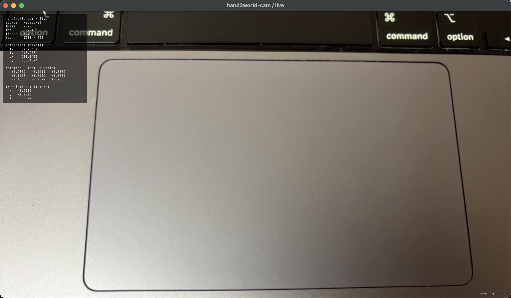

# hand2world-cam

Stream the rear ARKit camera from an **iPhone or iPad** to a Mac in real time. Every frame carries **RGB + camera intrinsics K + 4×4 camera-to-world pose T_cw**. Runs over **WiFi or USB** (wired tethering for lowest latency). **Resolution and frame rate are user-configurable** from the iOS app — pick any ARKit-supported format (e.g. 1280×720 @ 60 fps, 1920×1440 @ 60 fps) and JPEG quality on the fly.



## Quick start

In-repo use shares the main release env — no separate install needed. The demo client
(`hand2world_demo/client/client.py`) imports `hand2world_cam_SDK` directly from this dir.

To get the `hand2world-cam` CLI entry point (standalone live viewer) or to use the SDK
from a project outside this repo, install it into the same env:

```bash
conda activate hand2world                    # the env from the release-level install
pip install -e '.[fast]'                     # optional [fast] adds the pyglet GPU viewer

hand2world-cam                               # open the live viewer (prints iOS-app URLs)
```

From a Python script:

```python
from hand2world_cam_SDK import Hand2WorldCam

Hand2WorldCam().show()                       # live window — auto-uses GPU if pyglet is installed

with Hand2WorldCam() as cam:
    frame = cam.latest()                     # lossy snapshot
    for frame in cam.frames(): ...           # iterate every frame
    cam.on_frame(lambda f: ...)              # push-style callback
```

## Next

- **[docs/setup.md](docs/setup.md)** — full install (Mac Python env, Xcode signing, WiFi vs USB) and every config knob.
- **[docs/protocol.md](docs/protocol.md)** — wire format and coordinate conventions.

